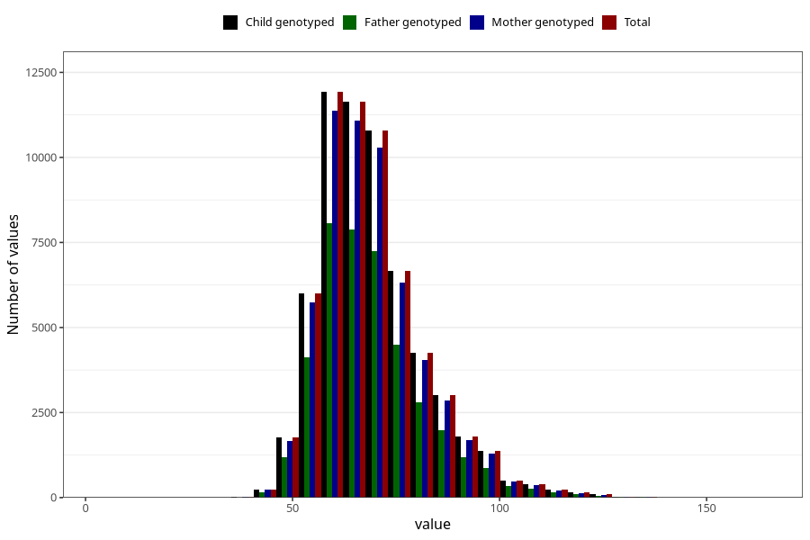

# mother_weight_6m
Variable mapping to `DD673` in `Skjema4_6mnd_v12`.
- Number of values:

| Value | Total | Child genotyped | Mother genotyped | Father genotyped |
| ----- | ----- | --------------- | ---------------- | ---------------- |
| Missing | 14395 | 14395 | 13655 | 9071 |
| Non-missing | 60913 | 60913 | 57995 | 41013 |
| 25th percentile | 60 | 60 | 60 | 60 |
| 50th percentile | 67 | 67 | 67 | 67 |
| 75th percentile | 75 | 75 | 75 | 75 |
| Mean | 69.1651437295815 | 69.1651437295815 | 69.1368324855591 | 69.0601224002146 |
| Standard deviation | 12.759845324236 | 12.759845324236 | 12.7296114401328 | 12.7341077236241 |
| N | 60913 | 60913 | 57995 | 41013 |

