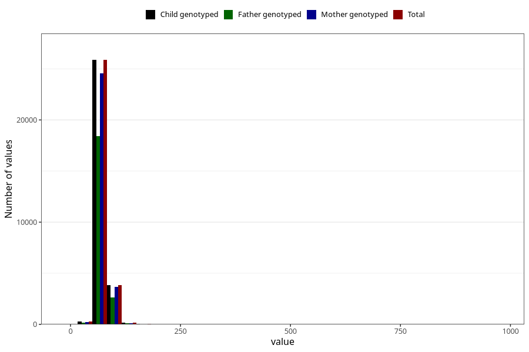

# mother_weight_8y
Variable mapping to `NN284` in `Skjema8aar_v12`.
- Number of values:

| Value | Total | Child genotyped | Mother genotyped | Father genotyped |
| ----- | ----- | --------------- | ---------------- | ---------------- |
| Missing | 45144 | 45144 | 43060 | 28735 |
| Non-missing | 30164 | 30164 | 28590 | 21349 |
| 25th percentile | 61 | 61 | 61 | 61 |
| 50th percentile | 68 | 68 | 68 | 67.5 |
| 75th percentile | 76 | 76 | 76 | 75.4 |
| Mean | 70.1015051054237 | 70.1015051054237 | 70.0584784889822 | 69.9369759707715 |
| Standard deviation | 16.8279741258613 | 16.8279741258613 | 16.6192088909022 | 17.4410488527435 |
| N | 30164 | 30164 | 28590 | 21349 |

