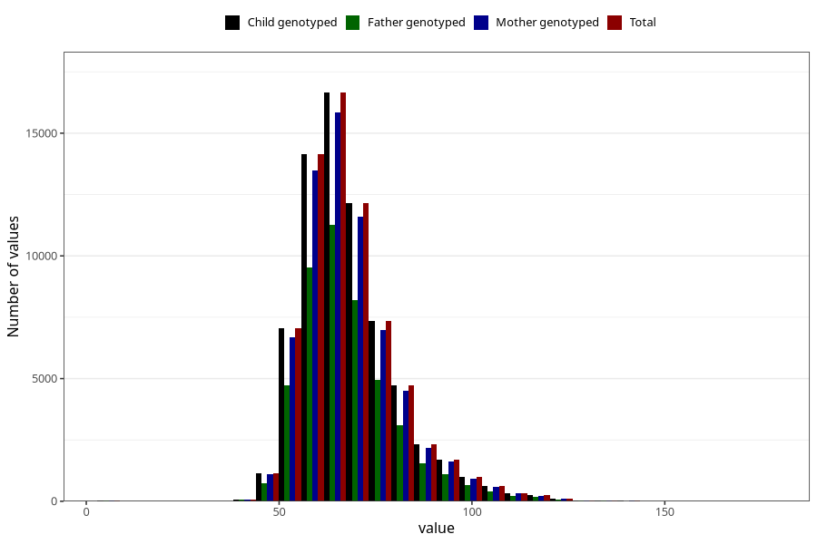

# mother_weight_beginning_self
Variable mapping to `AA85` in `Skjema1_v12`.
- Number of values:

| Value | Total | Child genotyped | Mother genotyped | Father genotyped |
| ----- | ----- | --------------- | ---------------- | ---------------- |
| Missing | 5537 | 5537 | 5258 | 3229 |
| Non-missing | 69771 | 69771 | 66392 | 46855 |
| 25th percentile | 60 | 60 | 60 | 60 |
| 50th percentile | 66 | 66 | 66 | 66 |
| 75th percentile | 74 | 74 | 74 | 74 |
| Mean | 68.1653552335498 | 68.1653552335498 | 68.1469002289433 | 68.1221427809199 |
| Standard deviation | 12.6982020627583 | 12.6982020627583 | 12.6723857753674 | 12.6213526977417 |
| N | 69771 | 69771 | 66392 | 46855 |

