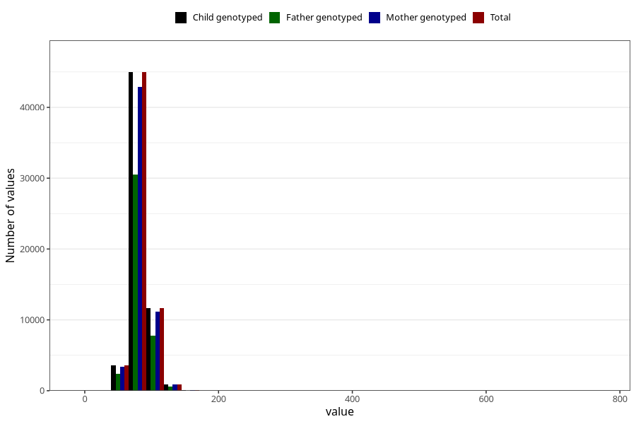

# mother_weight_end
Variable mapping to `MORS_VEKT_SLUTT` in `MFR_541_v12`.
Variable mapping to `MORS_VEKT_SLUTT` in `MFR_541_v12`.
- Number of values:

| Value | Total | Child genotyped | Mother genotyped | Father genotyped |
| ----- | ----- | --------------- | ---------------- | ---------------- |
| Missing | 14114 | 14114 | 13383 | 8841 |
| Non-missing | 61194 | 61194 | 58267 | 41243 |
| 25th percentile | 74 | 74 | 74 | 74 |
| 50th percentile | 81 | 81 | 81 | 81 |
| 75th percentile | 90 | 90 | 90 | 90 |
| Mean | 83.0239827434062 | 83.0239827434062 | 82.9935212041121 | 82.9379846276944 |
| Standard deviation | 13.5341421169666 | 13.5341421169666 | 13.5185325489891 | 13.1738792814531 |
| N | 61194 | 61194 | 58267 | 41243 |

