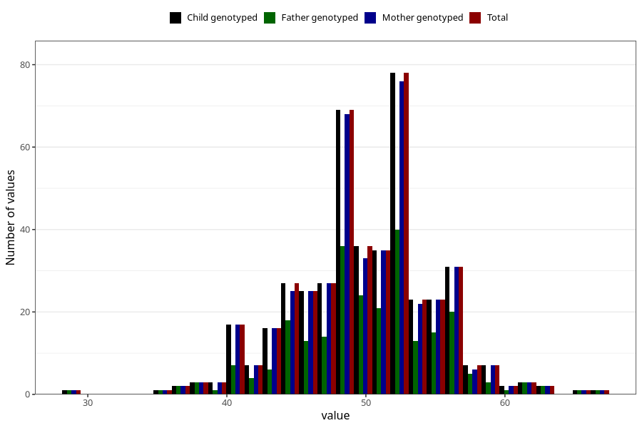

# water_pct_wf
Variable mapping to `WK17` in `WF_Klinikkskjema_v12`.
- Number of values:

| Value | Total | Child genotyped | Mother genotyped | Father genotyped |
| ----- | ----- | --------------- | ---------------- | ---------------- |
| Missing | 74861 | 74861 | 71213 | 49829 |
| Non-missing | 447 | 447 | 437 | 255 |
| 25th percentile | 47 | 47 | 47 | 47 |
| 50th percentile | 50 | 50 | 50 | 50 |
| 75th percentile | 53 | 53 | 53 | 53.5 |
| Mean | 49.9664429530201 | 49.9664429530201 | 49.9519450800915 | 50.2039215686275 |
| Standard deviation | 5.05407899118055 | 5.05407899118055 | 5.07557355340847 | 5.36002852796475 |
| N | 447 | 447 | 437 | 255 |

