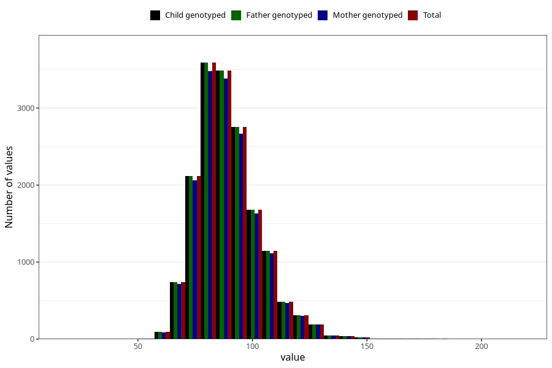

# weight_hf
Variable mapping to `HF128` in `HelseFedre`.
- Number of values:

| Value | Total | Child genotyped | Mother genotyped | Father genotyped |
| ----- | ----- | --------------- | ---------------- | ---------------- |
| Missing | 58567 | 58567 | 55401 | 33343 |
| Non-missing | 16741 | 16741 | 16249 | 16741 |
| 25th percentile | 80 | 80 | 80 | 80 |
| 50th percentile | 88 | 88 | 88 | 88 |
| 75th percentile | 97 | 97 | 97 | 97 |
| Mean | 89.5292395914223 | 89.5292395914223 | 89.498122961413 | 89.5292395914223 |
| Standard deviation | 13.9413752435333 | 13.9413752435333 | 13.8640400726586 | 13.9413752435333 |
| N | 16741 | 16741 | 16249 | 16741 |

