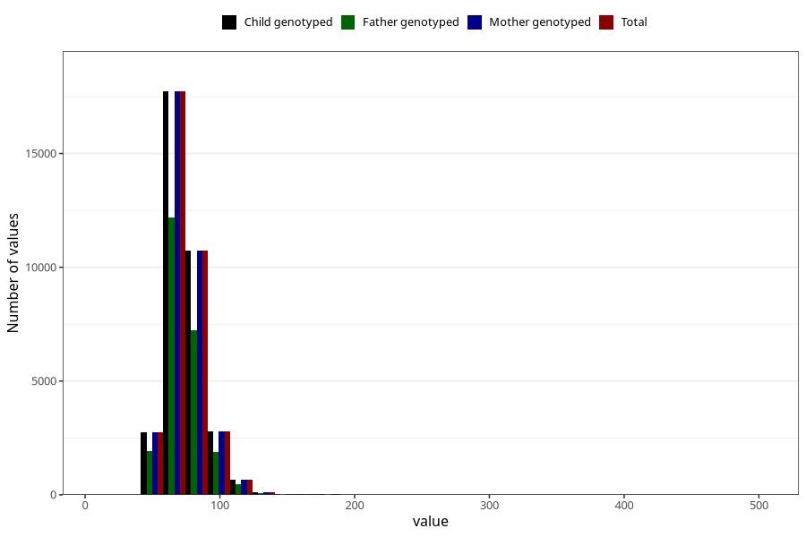

# weight_hm
Variable mapping to `HM260` in `HelseModre`.
- Number of values:

| Value | Total | Child genotyped | Mother genotyped | Father genotyped |
| ----- | ----- | --------------- | ---------------- | ---------------- |
| Missing | 40413 | 40413 | 36755 | 26286 |
| Non-missing | 34895 | 34895 | 34895 | 23798 |
| 25th percentile | 64 | 64 | 64 | 64 |
| 50th percentile | 71 | 71 | 71 | 71 |
| 75th percentile | 80 | 80 | 80 | 80 |
| Mean | 73.753890242155 | 73.753890242155 | 73.753890242155 | 73.6208925119758 |
| Standard deviation | 14.3045689031754 | 14.3045689031754 | 14.3045689031754 | 14.3459113546332 |
| N | 34895 | 34895 | 34895 | 23798 |

