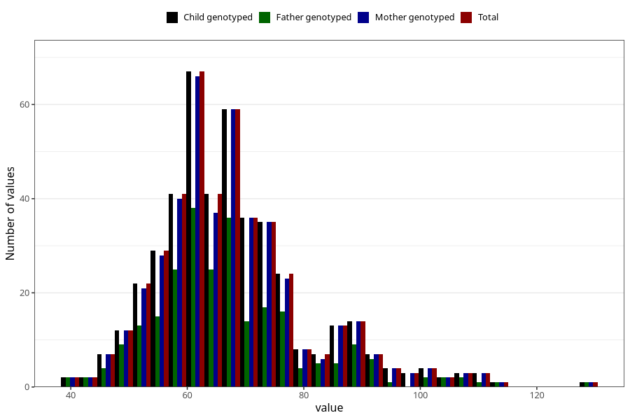

# weight_wf
Variable mapping to `WK15` in `WF_Klinikkskjema_v12`.
- Number of values:

| Value | Total | Child genotyped | Mother genotyped | Father genotyped |
| ----- | ----- | --------------- | ---------------- | ---------------- |
| Missing | 74861 | 74861 | 71213 | 49829 |
| Non-missing | 447 | 447 | 437 | 255 |
| 25th percentile | 59 | 59 | 59 | 59 |
| 50th percentile | 66 | 66 | 66 | 65 |
| 75th percentile | 74 | 74 | 74 | 73.5 |
| Mean | 67.7897091722595 | 67.7897091722595 | 67.8695652173913 | 67.3843137254902 |
| Standard deviation | 13.2413126324066 | 13.2413126324066 | 13.3120250888621 | 13.6794485278893 |
| N | 447 | 447 | 437 | 255 |

