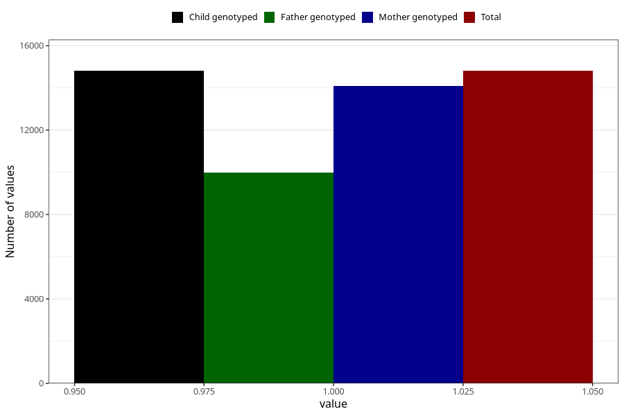

# back_pain_13w_15w
Variable mapping to `AA199` in `Skjema1_v12`.
- Number of values:

| Value | Total | Child genotyped | Mother genotyped | Father genotyped |
| ----- | ----- | --------------- | ---------------- | ---------------- |
| Missing | 60502 | 60502 | 57576 | 40093 |
| Non-missing | 14806 | 14806 | 14074 | 9991 |
| 1 | 14806 | 14806 | 14074 | 9991 |

