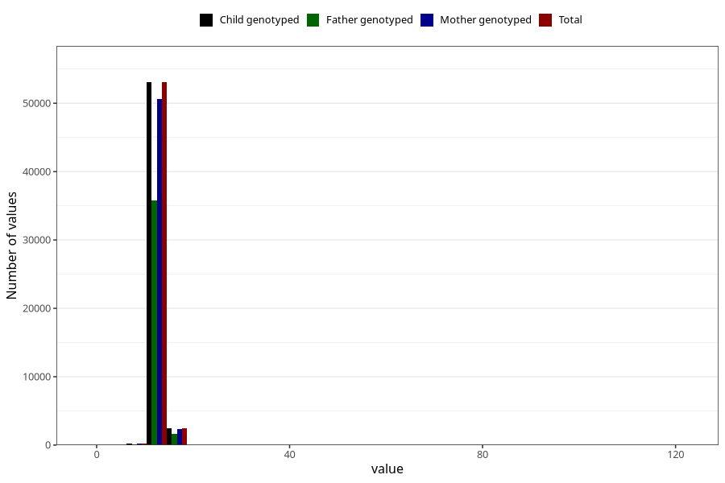

# blood_haemoglobin_highest_30w
Variable mapping to `CC126` in `Skjema3_v12`.
- Number of values:

| Value | Total | Child genotyped | Mother genotyped | Father genotyped |
| ----- | ----- | --------------- | ---------------- | ---------------- |
| Missing | 19471 | 19471 | 18376 | 12422 |
| Non-missing | 55837 | 55837 | 53274 | 37662 |
| 25th percentile | 12.3 | 12.3 | 12.3 | 12.3 |
| 50th percentile | 12.9 | 12.9 | 12.9 | 12.9 |
| 75th percentile | 13.5 | 13.5 | 13.5 | 13.6 |
| Mean | 13.0087916614431 | 13.0087916614431 | 13.0081972444344 | 13.0125750092932 |
| Standard deviation | 2.36913105836884 | 2.36913105836884 | 2.34379517531687 | 2.27235949053413 |
| N | 55837 | 55837 | 53274 | 37662 |

