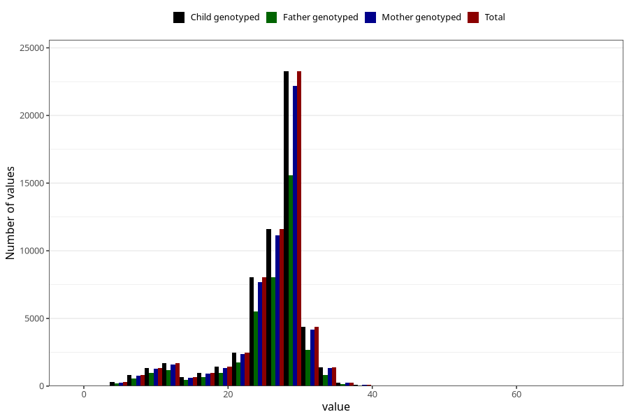

# blood_haemoglobin_last_check_week_30w
Variable mapping to `CC125` in `Skjema3_v12`.
- Number of values:

| Value | Total | Child genotyped | Mother genotyped | Father genotyped |
| ----- | ----- | --------------- | ---------------- | ---------------- |
| Missing | 16636 | 16636 | 15717 | 10453 |
| Non-missing | 58672 | 58672 | 55933 | 39631 |
| 25th percentile | 25 | 25 | 25 | 24 |
| 50th percentile | 28 | 28 | 28 | 27 |
| 75th percentile | 29 | 29 | 29 | 29 |
| Mean | 25.8466048541042 | 25.8466048541042 | 25.8571505193714 | 25.6725290807701 |
| Standard deviation | 5.63062152449818 | 5.63062152449818 | 5.61863819787589 | 5.69422300980084 |
| N | 58672 | 58672 | 55933 | 39631 |

