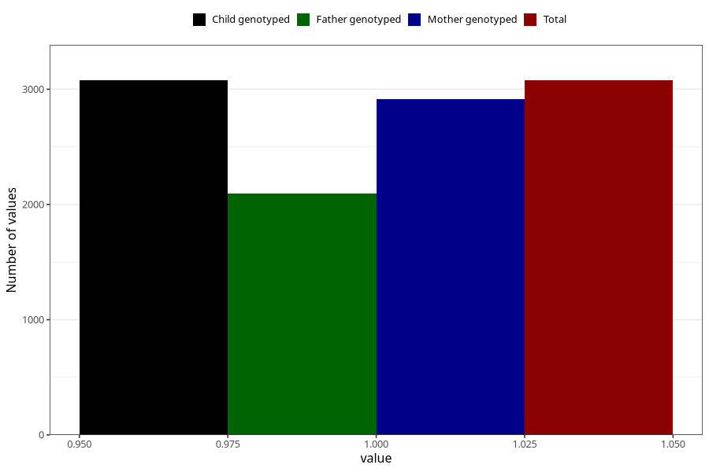

# common_cold_before_4w
Variable mapping to `AA346` in `Skjema1_v12`.
- Number of values:

| Value | Total | Child genotyped | Mother genotyped | Father genotyped |
| ----- | ----- | --------------- | ---------------- | ---------------- |
| Missing | 72231 | 72231 | 68737 | 47989 |
| Non-missing | 3077 | 3077 | 2913 | 2095 |
| 1 | 3077 | 3077 | 2913 | 2095 |

