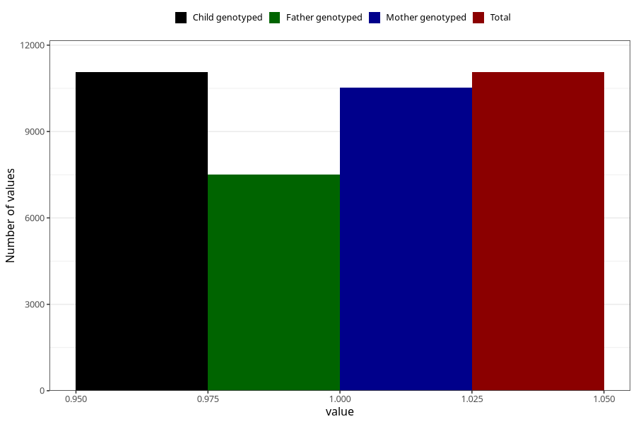

# constipation_17w_20w
Variable mapping to `CC437` in `Skjema3_v12`.
- Number of values:

| Value | Total | Child genotyped | Mother genotyped | Father genotyped |
| ----- | ----- | --------------- | ---------------- | ---------------- |
| Missing | 64248 | 64248 | 61125 | 42573 |
| Non-missing | 11060 | 11060 | 10525 | 7511 |
| 1 | 11060 | 11060 | 10525 | 7511 |

