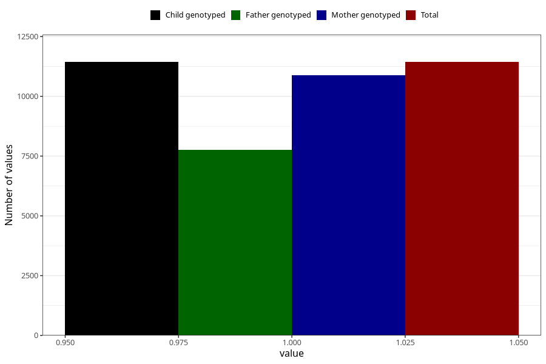

# constipation_after_29w
Variable mapping to `CC440` in `Skjema3_v12`.
- Number of values:

| Value | Total | Child genotyped | Mother genotyped | Father genotyped |
| ----- | ----- | --------------- | ---------------- | ---------------- |
| Missing | 63872 | 63872 | 60771 | 42318 |
| Non-missing | 11436 | 11436 | 10879 | 7766 |
| 1 | 11436 | 11436 | 10879 | 7766 |

