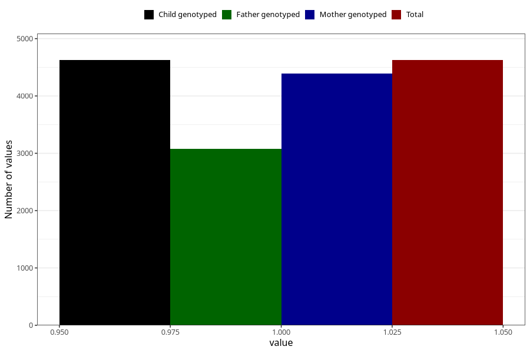

# constipation_before_4w
Variable mapping to `AA266` in `Skjema1_v12`.
- Number of values:

| Value | Total | Child genotyped | Mother genotyped | Father genotyped |
| ----- | ----- | --------------- | ---------------- | ---------------- |
| Missing | 70683 | 70683 | 67259 | 47003 |
| Non-missing | 4625 | 4625 | 4391 | 3081 |
| 1 | 4625 | 4625 | 4391 | 3081 |

