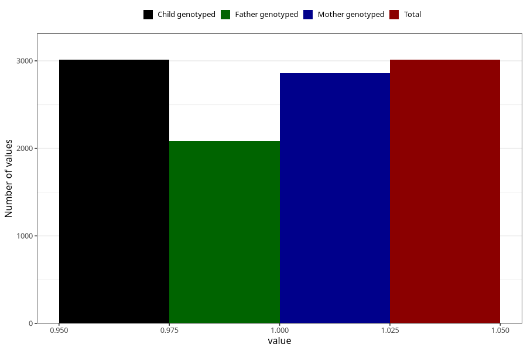

# diarrhoea_9w_12w
Variable mapping to `AA278` in `Skjema1_v12`.
- Number of values:

| Value | Total | Child genotyped | Mother genotyped | Father genotyped |
| ----- | ----- | --------------- | ---------------- | ---------------- |
| Missing | 72296 | 72296 | 68788 | 47997 |
| Non-missing | 3012 | 3012 | 2862 | 2087 |
| 1 | 3012 | 3012 | 2862 | 2087 |

