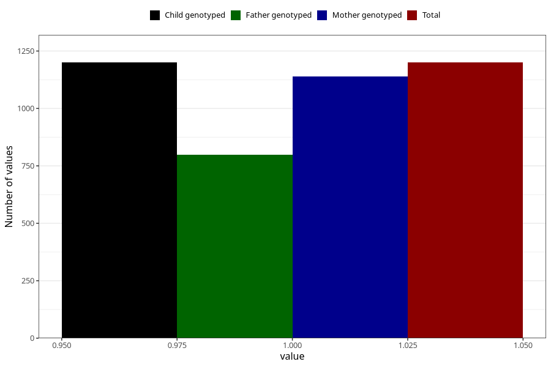

# diarrhoea_before_4w
Variable mapping to `AA276` in `Skjema1_v12`.
- Number of values:

| Value | Total | Child genotyped | Mother genotyped | Father genotyped |
| ----- | ----- | --------------- | ---------------- | ---------------- |
| Missing | 74108 | 74108 | 70511 | 49286 |
| Non-missing | 1200 | 1200 | 1139 | 798 |
| 1 | 1200 | 1200 | 1139 | 798 |

