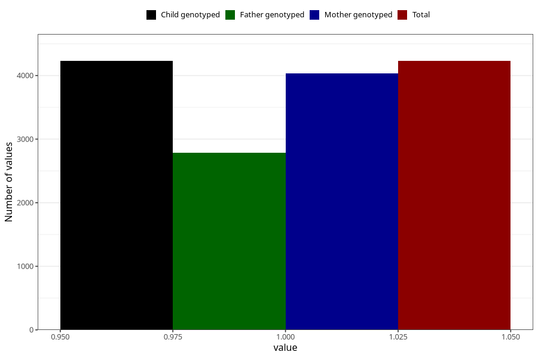

# heartburn_5w_8w
Variable mapping to `AA307` in `Skjema1_v12`.
- Number of values:

| Value | Total | Child genotyped | Mother genotyped | Father genotyped |
| ----- | ----- | --------------- | ---------------- | ---------------- |
| Missing | 71079 | 71079 | 67615 | 47297 |
| Non-missing | 4229 | 4229 | 4035 | 2787 |
| 1 | 4229 | 4229 | 4035 | 2787 |

