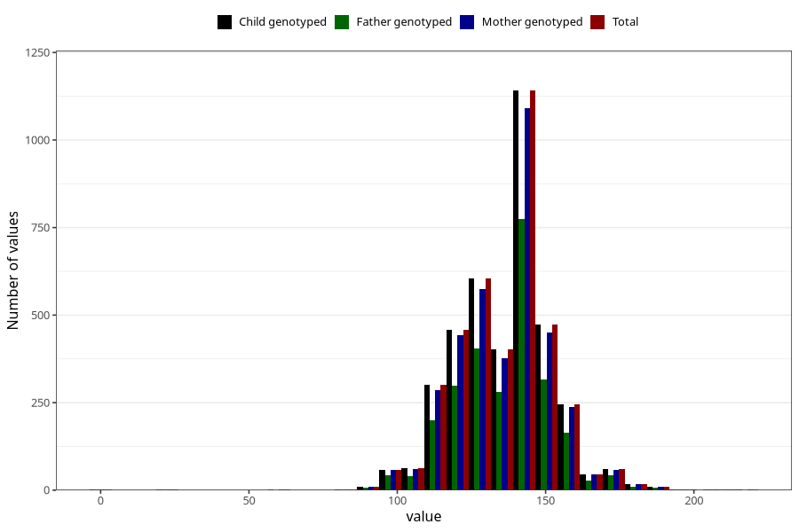

# highest_blood_pressure_during_pregnancy_30w_systolic
Variable mapping to `CC114` in `Skjema3_v12`.
- Number of values:

| Value | Total | Child genotyped | Mother genotyped | Father genotyped |
| ----- | ----- | --------------- | ---------------- | ---------------- |
| Missing | 71407 | 71407 | 67924 | 47462 |
| Non-missing | 3901 | 3901 | 3726 | 2622 |
| 25th percentile | 125 | 125 | 125 | 125 |
| 50th percentile | 140 | 140 | 140 | 140 |
| 75th percentile | 145 | 145 | 145 | 145 |
| Mean | 135.882594206614 | 135.882594206614 | 135.911701556629 | 135.891685736079 |
| Standard deviation | 15.9449552197764 | 15.9449552197764 | 15.9834305967411 | 15.9063843546815 |
| N | 3901 | 3901 | 3726 | 2622 |

