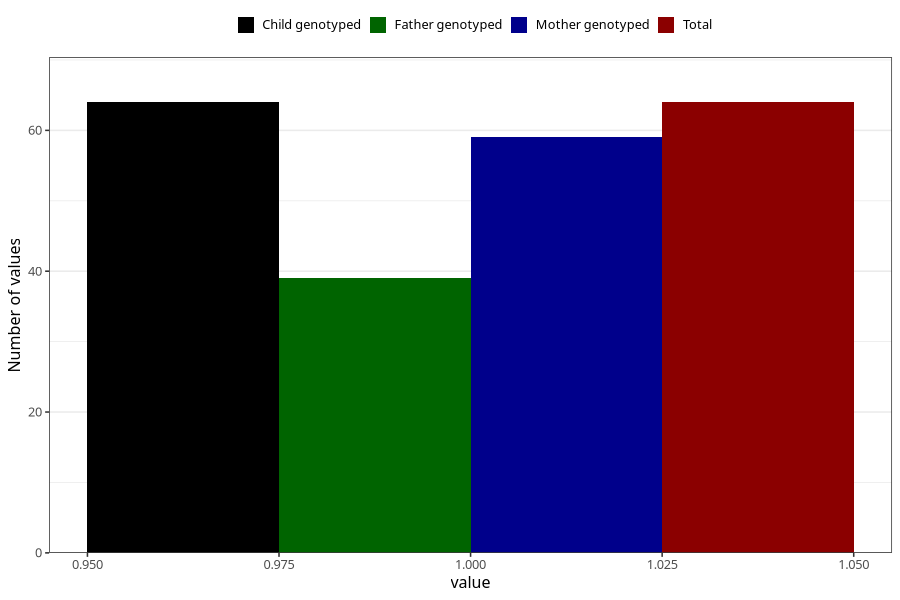

# hospitalized_bleeding_9_12w
Variable mapping to `CC149` in `Skjema3_v12`.
- Number of values:

| Value | Total | Child genotyped | Mother genotyped | Father genotyped |
| ----- | ----- | --------------- | ---------------- | ---------------- |
| Missing | 75244 | 75244 | 71591 | 50045 |
| Non-missing | 64 | 64 | 59 | 39 |
| 1 | 64 | 64 | 59 | 39 |

