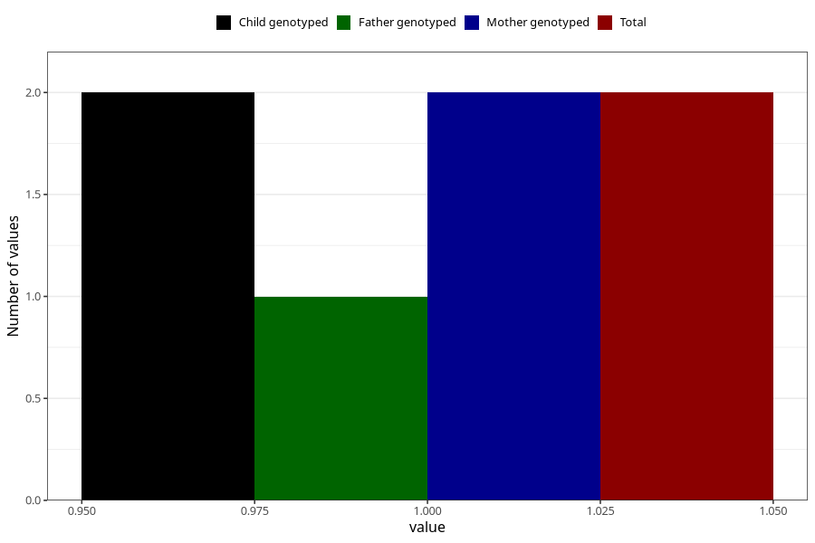

# hospitalized_high_blood_pressure_9_12w
Variable mapping to `CC176` in `Skjema3_v12`.
- Number of values:

| Value | Total | Child genotyped | Mother genotyped | Father genotyped |
| ----- | ----- | --------------- | ---------------- | ---------------- |
| Missing | 75306 | 75306 | 71648 | 50083 |
| Non-missing | 2 | 2 | 2 | 1 |
| 1 | 2 | 2 | 2 | 1 |

