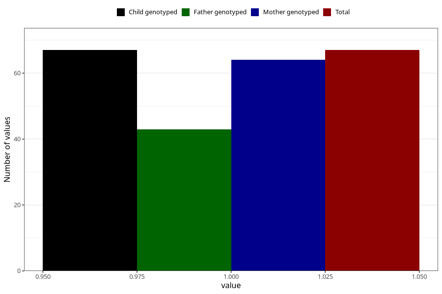

# hospitalized_prolonged_nausea_vomiting_17_20w
Variable mapping to `CC142` in `Skjema3_v12`.
- Number of values:

| Value | Total | Child genotyped | Mother genotyped | Father genotyped |
| ----- | ----- | --------------- | ---------------- | ---------------- |
| Missing | 75241 | 75241 | 71586 | 50041 |
| Non-missing | 67 | 67 | 64 | 43 |
| 1 | 67 | 67 | 64 | 43 |

