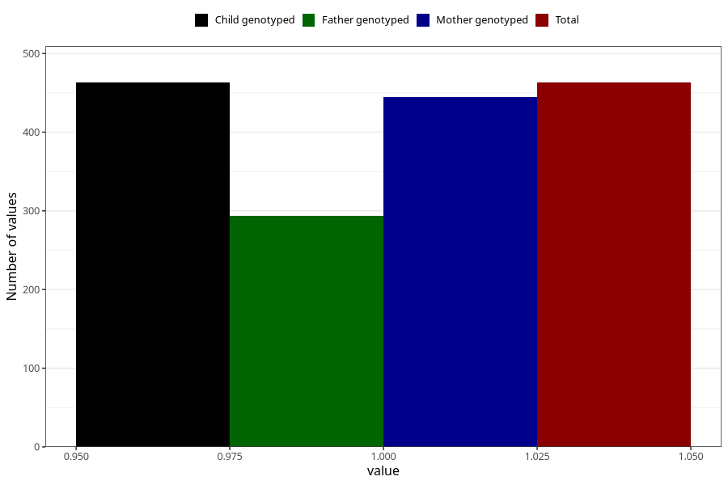

# hospitalized_threatening_preterm_labour
Variable mapping to `CC164` in `Skjema3_v12`.
- Number of values:

| Value | Total | Child genotyped | Mother genotyped | Father genotyped |
| ----- | ----- | --------------- | ---------------- | ---------------- |
| Missing | 74845 | 74845 | 71205 | 49790 |
| Non-missing | 463 | 463 | 445 | 294 |
| 1 | 463 | 463 | 445 | 294 |

