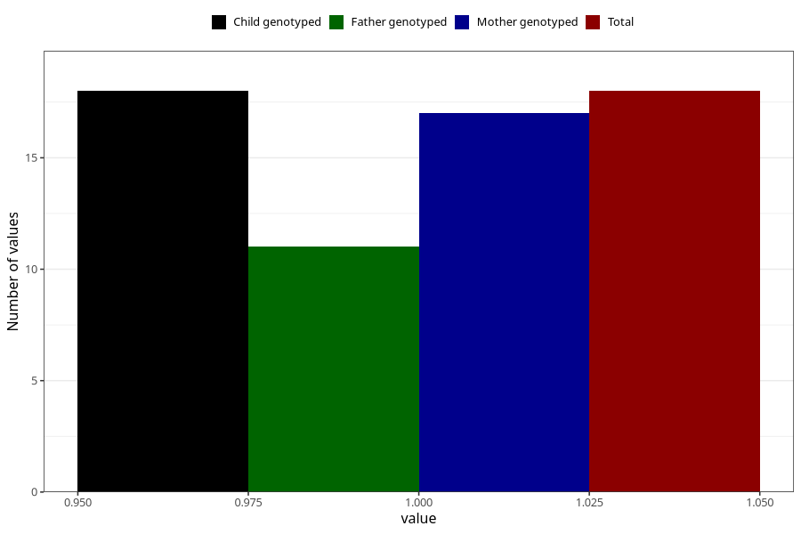

# hospitalized_threatening_preterm_labour_17_20w
Variable mapping to `CC169` in `Skjema3_v12`.
- Number of values:

| Value | Total | Child genotyped | Mother genotyped | Father genotyped |
| ----- | ----- | --------------- | ---------------- | ---------------- |
| Missing | 75290 | 75290 | 71633 | 50073 |
| Non-missing | 18 | 18 | 17 | 11 |
| 1 | 18 | 18 | 17 | 11 |

