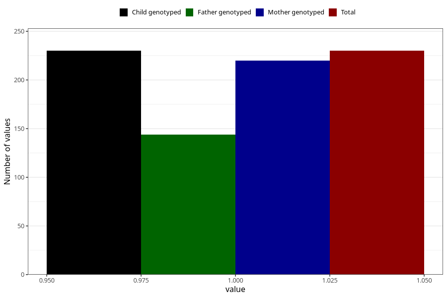

# hospitalized_threatening_preterm_labour_25_28w
Variable mapping to `CC171` in `Skjema3_v12`.
- Number of values:

| Value | Total | Child genotyped | Mother genotyped | Father genotyped |
| ----- | ----- | --------------- | ---------------- | ---------------- |
| Missing | 75078 | 75078 | 71430 | 49940 |
| Non-missing | 230 | 230 | 220 | 144 |
| 1 | 230 | 230 | 220 | 144 |

