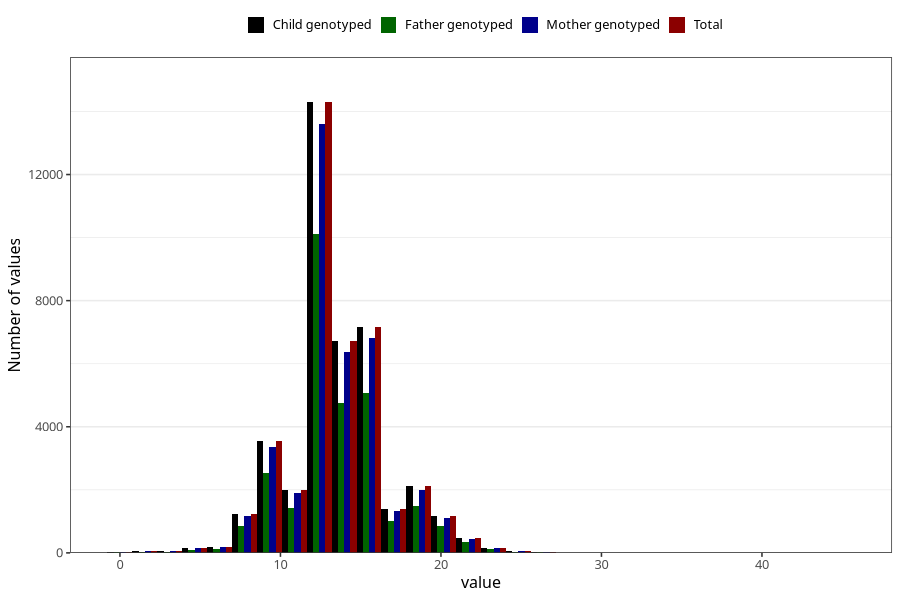

# nausea_week_most_bothered_to_q2
Variable mapping to `BB854` in `Skjema2CDW_v12`.
- Number of values:

| Value | Total | Child genotyped | Mother genotyped | Father genotyped |
| ----- | ----- | --------------- | ---------------- | ---------------- |
| Missing | 34441 | 34441 | 32859 | 21169 |
| Non-missing | 40867 | 40867 | 38791 | 28915 |
| 25th percentile | 12 | 12 | 12 | 12 |
| 50th percentile | 13 | 13 | 13 | 13 |
| 75th percentile | 15 | 15 | 15 | 15 |
| Mean | 13.5335356155333 | 13.5335356155333 | 13.5266943363151 | 13.5602282552308 |
| Standard deviation | 3.07637328114483 | 3.07637328114483 | 3.07554662765831 | 3.05136823709204 |
| N | 40867 | 40867 | 38791 | 28915 |

