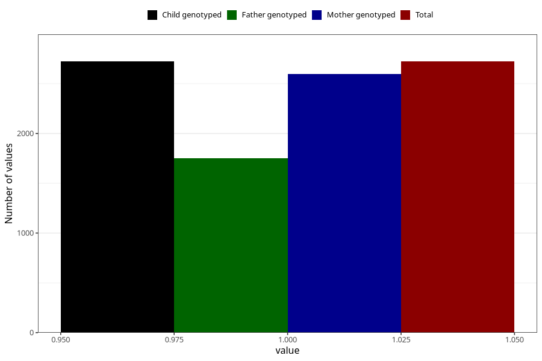

# oedema_13w_15w
Variable mapping to `AA319` in `Skjema1_v12`.
- Number of values:

| Value | Total | Child genotyped | Mother genotyped | Father genotyped |
| ----- | ----- | --------------- | ---------------- | ---------------- |
| Missing | 72585 | 72585 | 69054 | 48331 |
| Non-missing | 2723 | 2723 | 2596 | 1753 |
| 1 | 2723 | 2723 | 2596 | 1753 |

