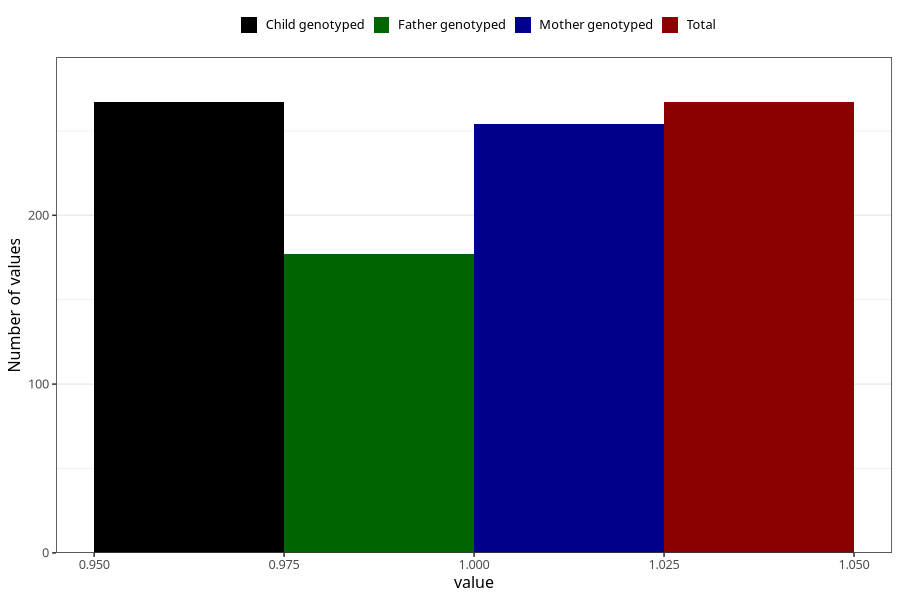

# oedema_before_4w
Variable mapping to `AA316` in `Skjema1_v12`.
- Number of values:

| Value | Total | Child genotyped | Mother genotyped | Father genotyped |
| ----- | ----- | --------------- | ---------------- | ---------------- |
| Missing | 75041 | 75041 | 71396 | 49907 |
| Non-missing | 267 | 267 | 254 | 177 |
| 1 | 267 | 267 | 254 | 177 |

