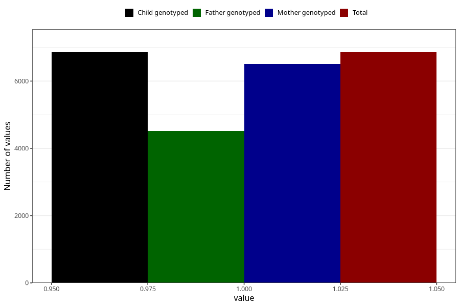

# pelvic_girdle_pain_13w_16w
Variable mapping to `CC340` in `Skjema3_v12`.
- Number of values:

| Value | Total | Child genotyped | Mother genotyped | Father genotyped |
| ----- | ----- | --------------- | ---------------- | ---------------- |
| Missing | 68452 | 68452 | 65137 | 45563 |
| Non-missing | 6856 | 6856 | 6513 | 4521 |
| 1 | 6856 | 6856 | 6513 | 4521 |

