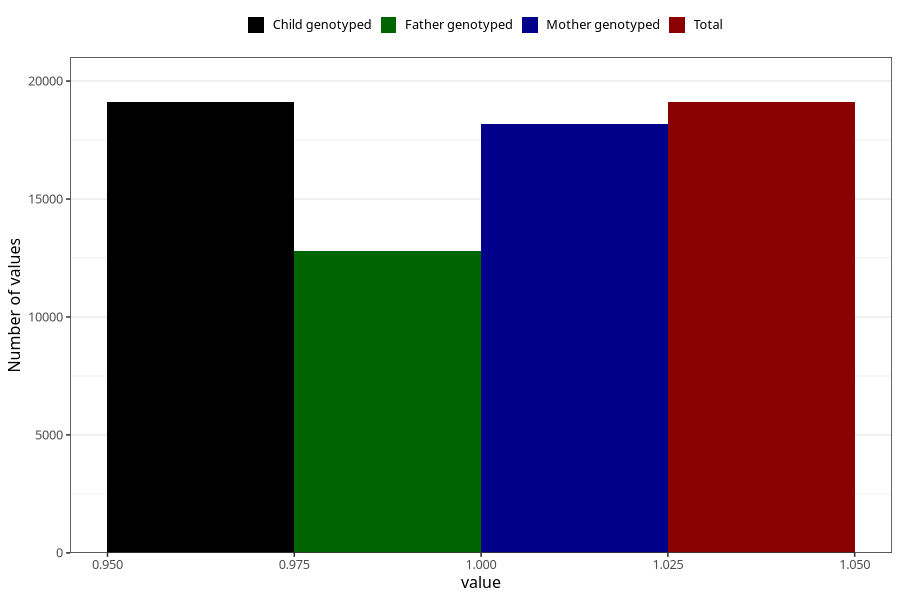

# pelvic_girdle_pain_after_29w
Variable mapping to `CC344` in `Skjema3_v12`.
- Number of values:

| Value | Total | Child genotyped | Mother genotyped | Father genotyped |
| ----- | ----- | --------------- | ---------------- | ---------------- |
| Missing | 56204 | 56204 | 53482 | 37278 |
| Non-missing | 19104 | 19104 | 18168 | 12806 |
| 1 | 19104 | 19104 | 18168 | 12806 |

