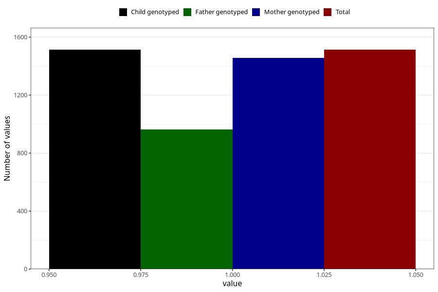

# pregnancy_itch_5w_8w
Variable mapping to `AA257` in `Skjema1_v12`.
- Number of values:

| Value | Total | Child genotyped | Mother genotyped | Father genotyped |
| ----- | ----- | --------------- | ---------------- | ---------------- |
| Missing | 73795 | 73795 | 70193 | 49122 |
| Non-missing | 1513 | 1513 | 1457 | 962 |
| 1 | 1513 | 1513 | 1457 | 962 |

