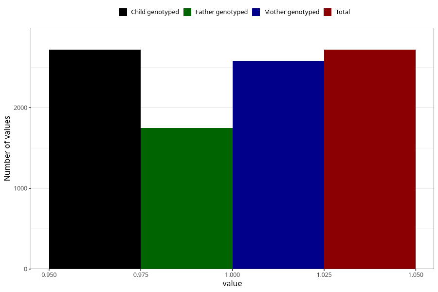

# pregnancy_itch_9w_12w
Variable mapping to `AA258` in `Skjema1_v12`.
- Number of values:

| Value | Total | Child genotyped | Mother genotyped | Father genotyped |
| ----- | ----- | --------------- | ---------------- | ---------------- |
| Missing | 72590 | 72590 | 69068 | 48335 |
| Non-missing | 2718 | 2718 | 2582 | 1749 |
| 1 | 2718 | 2718 | 2582 | 1749 |

