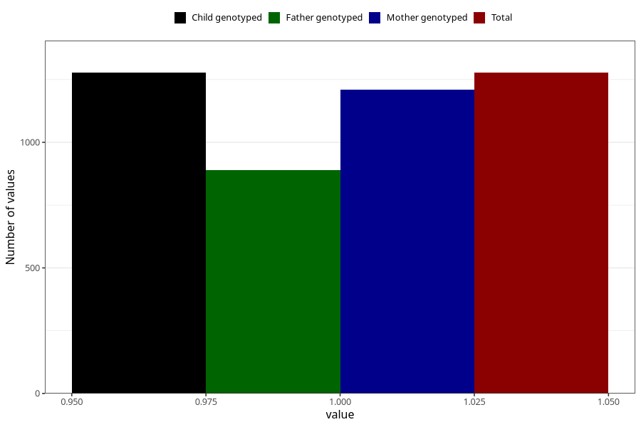

# protein_in_urine_9w_12w
Variable mapping to `AA408` in `Skjema1_v12`.
- Number of values:

| Value | Total | Child genotyped | Mother genotyped | Father genotyped |
| ----- | ----- | --------------- | ---------------- | ---------------- |
| Missing | 74031 | 74031 | 70440 | 49196 |
| Non-missing | 1277 | 1277 | 1210 | 888 |
| 1 | 1277 | 1277 | 1210 | 888 |

