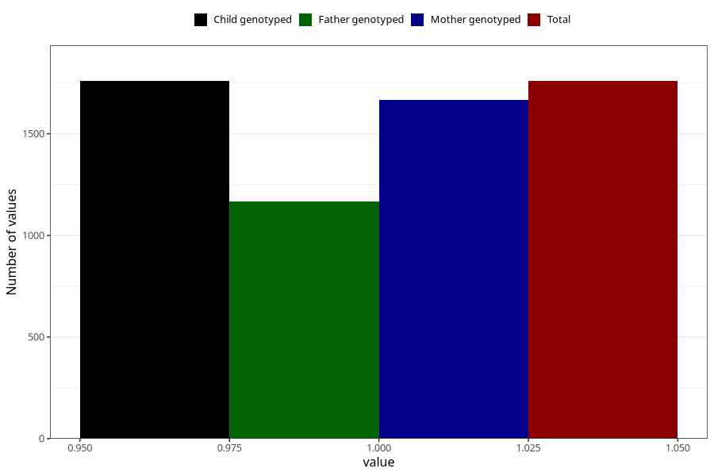

# sleeping_problems_before_4w
Variable mapping to `AA296` in `Skjema1_v12`.
- Number of values:

| Value | Total | Child genotyped | Mother genotyped | Father genotyped |
| ----- | ----- | --------------- | ---------------- | ---------------- |
| Missing | 73549 | 73549 | 69985 | 48916 |
| Non-missing | 1759 | 1759 | 1665 | 1168 |
| 1 | 1759 | 1759 | 1665 | 1168 |

