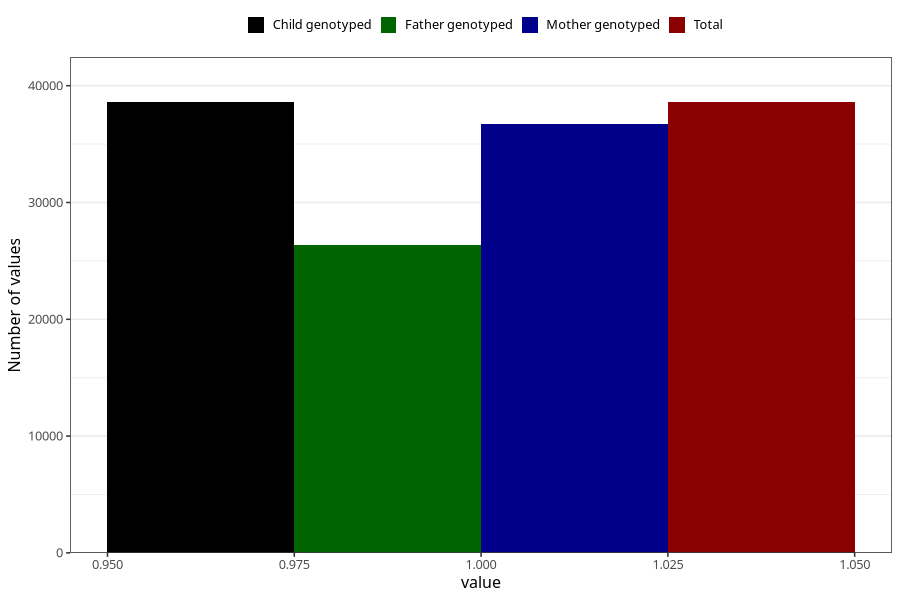

# unusual_tiredness_9w_12w
Variable mapping to `AA288` in `Skjema1_v12`.
- Number of values:

| Value | Total | Child genotyped | Mother genotyped | Father genotyped |
| ----- | ----- | --------------- | ---------------- | ---------------- |
| Missing | 36722 | 36722 | 34908 | 23730 |
| Non-missing | 38586 | 38586 | 36742 | 26354 |
| 1 | 38586 | 38586 | 36742 | 26354 |

