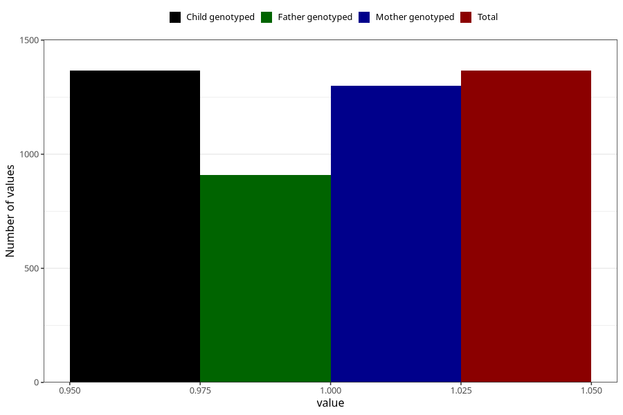

# vaginal_bleeding_1_17w_20w
Variable mapping to `CC318` in `Skjema3_v12`.
- Number of values:

| Value | Total | Child genotyped | Mother genotyped | Father genotyped |
| ----- | ----- | --------------- | ---------------- | ---------------- |
| Missing | 73942 | 73942 | 70349 | 49174 |
| Non-missing | 1366 | 1366 | 1301 | 910 |
| 1 | 1366 | 1366 | 1301 | 910 |

