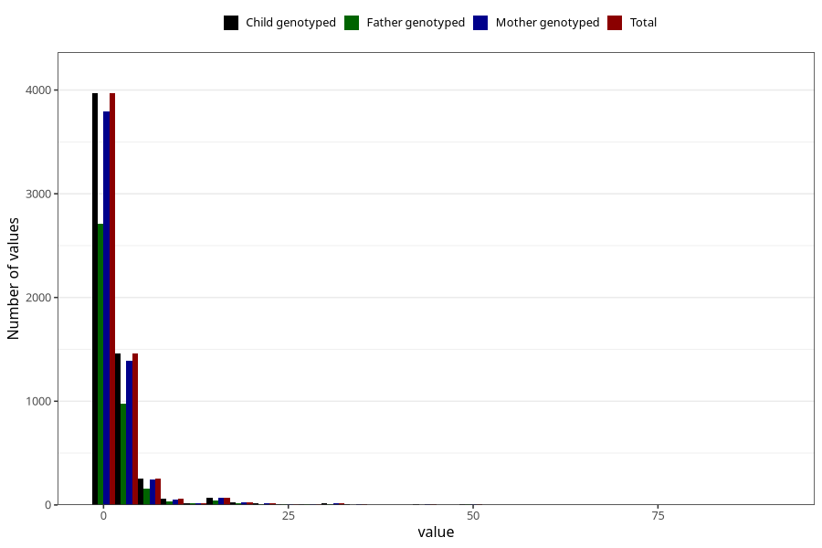

# vaginal_bleeding_1_duration
Variable mapping to `CC322` in `Skjema3_v12`.
- Number of values:

| Value | Total | Child genotyped | Mother genotyped | Father genotyped |
| ----- | ----- | --------------- | ---------------- | ---------------- |
| Missing | 69375 | 69375 | 65976 | 46085 |
| Non-missing | 5933 | 5933 | 5674 | 3999 |
| 25th percentile | 1 | 1 | 1 | 1 |
| 50th percentile | 1 | 1 | 1 | 1 |
| 75th percentile | 2 | 2 | 2 | 2 |
| Mean | 2.38058317883027 | 2.38058317883027 | 2.39654564681001 | 2.28157039259815 |
| Standard deviation | 5.01448749375754 | 5.01448749375754 | 5.08031341541546 | 4.78583221911282 |
| N | 5933 | 5933 | 5674 | 3999 |

