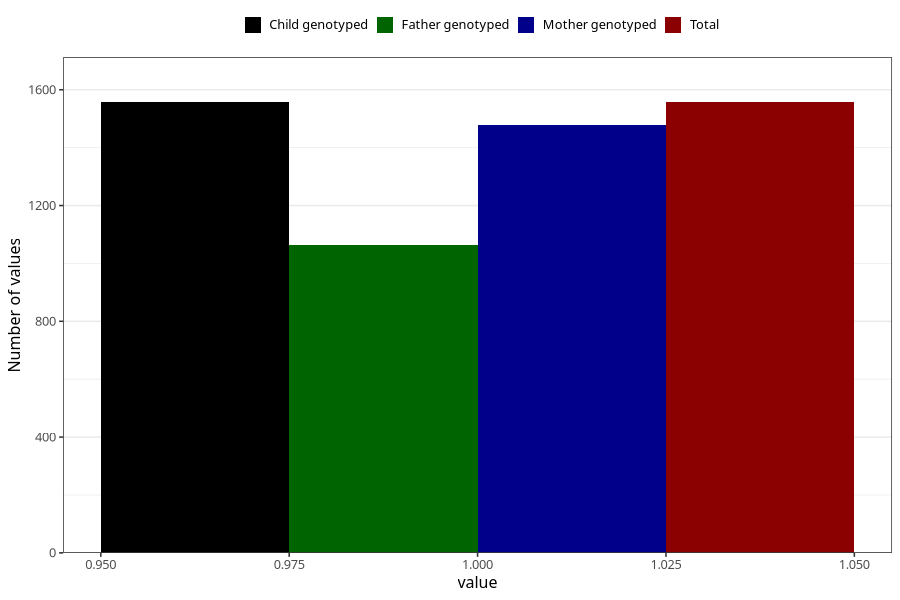

# vaginal_catarrh_unusual_discharge_after_29w
Variable mapping to `CC416` in `Skjema3_v12`.
- Number of values:

| Value | Total | Child genotyped | Mother genotyped | Father genotyped |
| ----- | ----- | --------------- | ---------------- | ---------------- |
| Missing | 73751 | 73751 | 70171 | 49019 |
| Non-missing | 1557 | 1557 | 1479 | 1065 |
| 1 | 1557 | 1557 | 1479 | 1065 |

