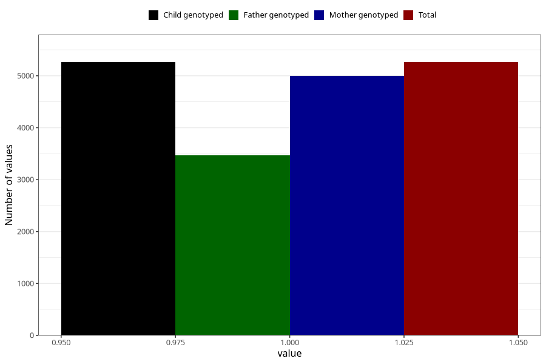

# vomiting_before_4w
Variable mapping to `AA226` in `Skjema1_v12`.
- Number of values:

| Value | Total | Child genotyped | Mother genotyped | Father genotyped |
| ----- | ----- | --------------- | ---------------- | ---------------- |
| Missing | 70043 | 70043 | 66656 | 46611 |
| Non-missing | 5265 | 5265 | 4994 | 3473 |
| 1 | 5265 | 5265 | 4994 | 3473 |

