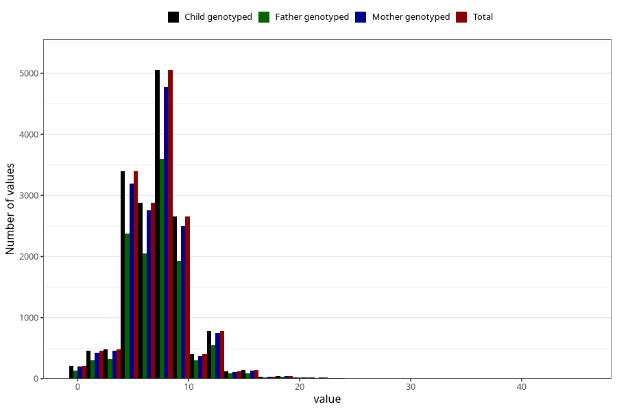

# vomiting_week_from_q2
Variable mapping to `BB857` in `Skjema2CDW_v12`.
- Number of values:

| Value | Total | Child genotyped | Mother genotyped | Father genotyped |
| ----- | ----- | --------------- | ---------------- | ---------------- |
| Missing | 58594 | 58594 | 55833 | 38241 |
| Non-missing | 16714 | 16714 | 15817 | 11843 |
| 25th percentile | 5 | 5 | 5 | 5 |
| 50th percentile | 7 | 7 | 7 | 7 |
| 75th percentile | 9 | 9 | 9 | 9 |
| Mean | 7.13264329304774 | 7.13264329304774 | 7.12916482265916 | 7.1606856370852 |
| Standard deviation | 3.01019359363297 | 3.01019359363297 | 3.00805187650778 | 2.94943044422689 |
| N | 16714 | 16714 | 15817 | 11843 |

