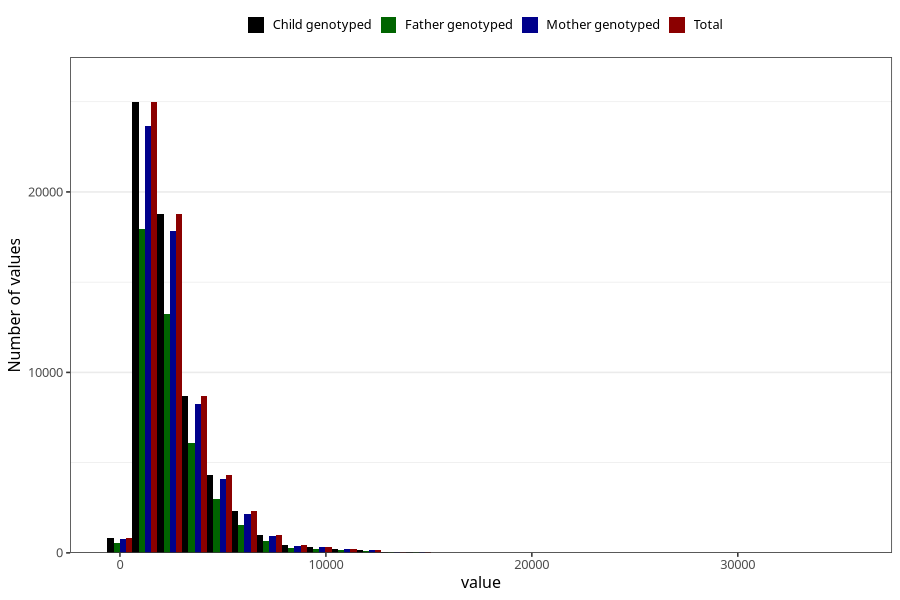

# beta_carotene
Variable mapping to `BETAKAROTEN` in `Skjema2_beregning_CDW_v12`.
- Number of values:

| Value | Total | Child genotyped | Mother genotyped | Father genotyped |
| ----- | ----- | --------------- | ---------------- | ---------------- |
| Missing | 13178 | 13178 | 12654 | 6217 |
| Non-missing | 62130 | 62130 | 58996 | 43867 |
| 25th percentile | 1451.5475 | 1451.5475 | 1451.915 | 1443.555 |
| 50th percentile | 2036.57 | 2036.57 | 2036.845 | 2017.49 |
| 75th percentile | 3222.1675 | 3222.1675 | 3223.1025 | 3191 |
| Mean | 2612.60358892644 | 2612.60358892644 | 2614.68429503695 | 2585.66155811886 |
| Standard deviation | 1839.34577985133 | 1839.34577985133 | 1839.89137082436 | 1814.02933005461 |
| N | 62130 | 62130 | 58996 | 43867 |

