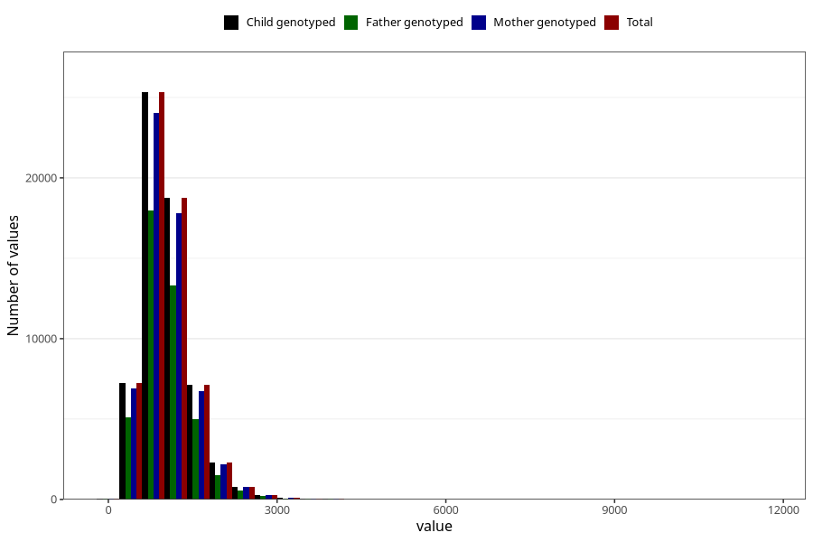

# calsium
Variable mapping to `KALSIUM` in `Skjema2_beregning_CDW_v12`.
- Number of values:

| Value | Total | Child genotyped | Mother genotyped | Father genotyped |
| ----- | ----- | --------------- | ---------------- | ---------------- |
| Missing | 13178 | 13178 | 12654 | 6217 |
| Non-missing | 62130 | 62130 | 58996 | 43867 |
| 25th percentile | 752.4075 | 752.4075 | 751.9175 | 751.92 |
| 50th percentile | 977.315 | 977.315 | 977.05 | 975.55 |
| 75th percentile | 1265.6175 | 1265.6175 | 1264.875 | 1259.92 |
| Mean | 1055.79776935458 | 1055.79776935458 | 1054.76918909757 | 1050.54696081337 |
| Standard deviation | 468.164749341561 | 468.164749341561 | 466.717600650823 | 459.576962755146 |
| N | 62130 | 62130 | 58996 | 43867 |

