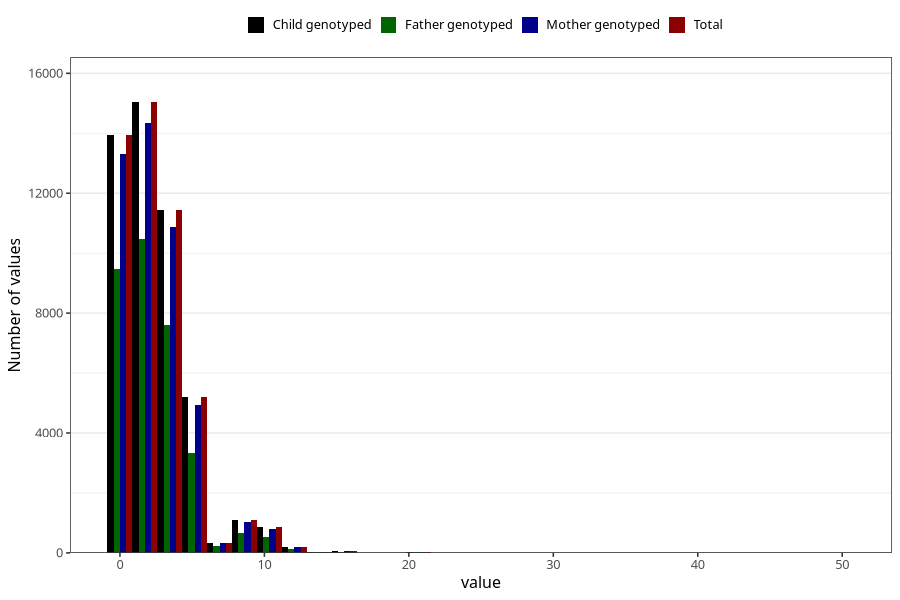

# coffee_before_filter
Variable mapping to `AA1377` in `Skjema1_v12`.
- Number of values:

| Value | Total | Child genotyped | Mother genotyped | Father genotyped |
| ----- | ----- | --------------- | ---------------- | ---------------- |
| Missing | 27065 | 27065 | 25705 | 17585 |
| Non-missing | 48243 | 48243 | 45945 | 32499 |
| Consumption have been reported by a mark but no amount given | 1 | 1 | 1 |1 |
| 25th percentile | 0 | 0 | 0 | 0 |
| 50th percentile | 2 | 2 | 2 | 2 |
| 75th percentile | 4 | 4 | 4 | 4 |
| Mean | 2.44544173127151 | 2.44544173127151 | 2.44177694584712 | 2.37830020308942 |
| Standard deviation | 2.51918244472521 | 2.51918244472521 | 2.51923040817403 | 2.45430390022302 |
| N | 48242 | 48242 | 45944 | 32498 |

