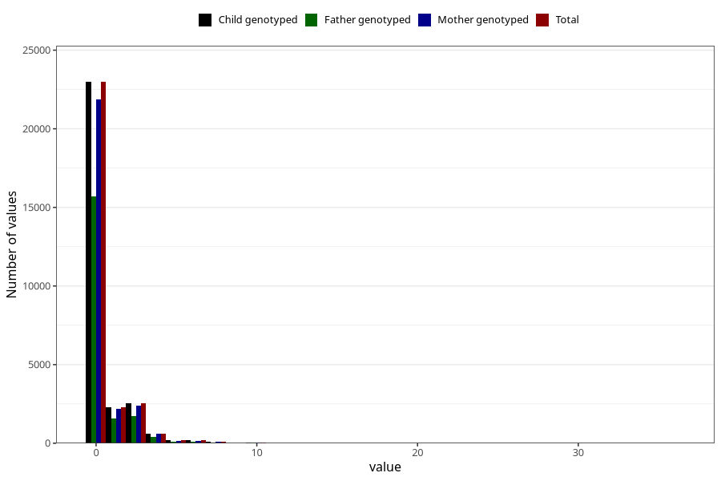

# coffee_before_instant
Variable mapping to `AA1380` in `Skjema1_v12`.
- Number of values:

| Value | Total | Child genotyped | Mother genotyped | Father genotyped |
| ----- | ----- | --------------- | ---------------- | ---------------- |
| Missing | 46372 | 46372 | 44128 | 30360 |
| Non-missing | 28936 | 28936 | 27522 | 19724 |
| 0 | 22980 | 22980 | 21884 | 15699 |
| 1 | 2295 | 2295 | 2182 | 1583 |
| 2 | 1992 | 1992 | 1876 | 1335 |
| 3 | 546 | 546 | 529 | 372 |
| 4 | 619 | 619 | 580 | 413 |
| 5 | 180 | 180 | 166 | 112 |
| 6 | 175 | 175 | 167 | 112 |
| 7 | 16 | 16 | 16 | 13 |
| 8 | 74 | 74 | 67 | 49 |
| 9 | 2 | 2 | 2 | 2 |
| 10 | 43 | 43 | 41 | 26 |
| 12 | 6 | 6 | 6 | 3 |
| 14 | 2 | 2 | 2 | 2 |
| 15 | 3 | 3 | 1 | 2 |
| 16 | 1 | 1 | 1 | 1 |
| 24 | 1 | 1 | 1 | 0 |
| 36 | 1 | 1 | 1 | 0 |

