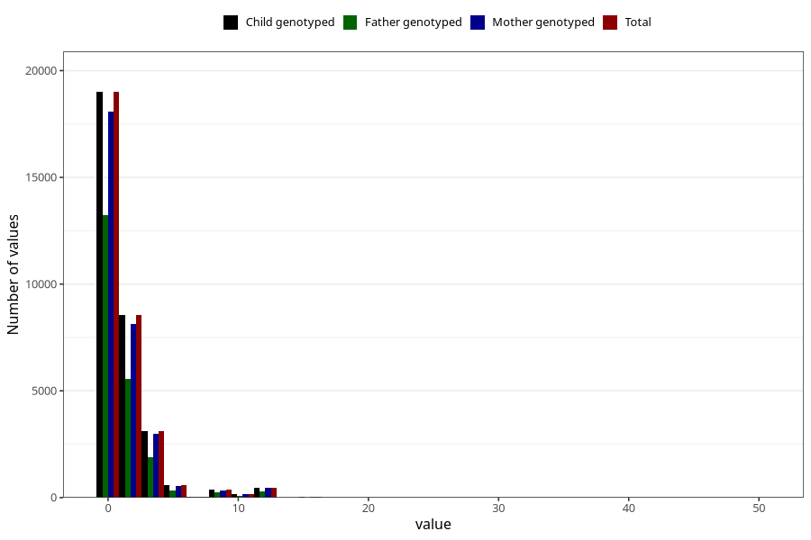

# coke_before
Variable mapping to `AA1392` in `Skjema1_v12`.
- Number of values:

| Value | Total | Child genotyped | Mother genotyped | Father genotyped |
| ----- | ----- | --------------- | ---------------- | ---------------- |
| Missing | 42981 | 42981 | 40886 | 28381 |
| Non-missing | 32327 | 32327 | 30764 | 21703 |
| Consumption have been reported by a mark but no amount given | 5 | 5 | 4 |2 |
| 25th percentile | 0 | 0 | 0 | 0 |
| 50th percentile | 0 | 0 | 0 | 0 |
| 75th percentile | 1 | 1 | 1 | 1 |
| Mean | 1.18439453004146 | 1.18439453004146 | 1.18641092327698 | 1.09460393530252 |
| Standard deviation | 2.29969676215984 | 2.29969676215984 | 2.30368638495716 | 2.21216554785077 |
| N | 32322 | 32322 | 30760 | 21701 |

