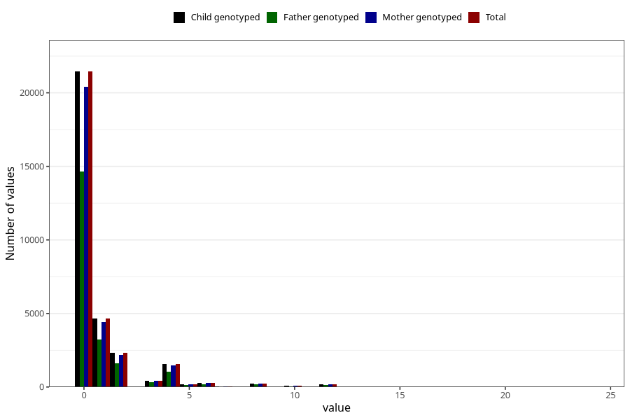

# diet_coke_during
Variable mapping to `AA1399` in `Skjema1_v12`.
- Number of values:

| Value | Total | Child genotyped | Mother genotyped | Father genotyped |
| ----- | ----- | --------------- | ---------------- | ---------------- |
| Missing | 43823 | 43823 | 41709 | 28549 |
| Non-missing | 31485 | 31485 | 29941 | 21535 |
| Consumption have been reported by a mark but no amount given | 1 | 1 | 1 |0 |
| 0 | 21447 | 21447 | 20424 | 14650 |
| 1 | 4658 | 4658 | 4424 | 3241 |
| 2 | 2322 | 2322 | 2199 | 1598 |
| 3 | 438 | 438 | 416 | 304 |
| 4 | 1547 | 1547 | 1458 | 1057 |
| 5 | 192 | 192 | 177 | 131 |
| 6 | 276 | 276 | 268 | 184 |
| 7 | 27 | 27 | 24 | 14 |
| 8 | 244 | 244 | 233 | 165 |
| 9 | 9 | 9 | 8 | 5 |
| 10 | 84 | 84 | 81 | 42 |
| 12 | 201 | 201 | 191 | 116 |
| 14 | 1 | 1 | 1 | 1 |
| 15 | 9 | 9 | 9 | 8 |
| 16 | 14 | 14 | 13 | 10 |
| 18 | 3 | 3 | 3 | 1 |
| 20 | 3 | 3 | 3 | 2 |
| 22 | 1 | 1 | 1 | 0 |
| 24 | 8 | 8 | 7 | 6 |

