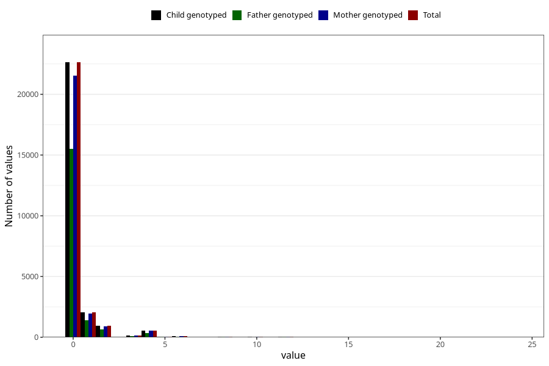

# diet_soda_during
Variable mapping to `AA1402` in `Skjema1_v12`.
- Number of values:

| Value | Total | Child genotyped | Mother genotyped | Father genotyped |
| ----- | ----- | --------------- | ---------------- | ---------------- |
| Missing | 48708 | 48708 | 46345 | 31884 |
| Non-missing | 26600 | 26600 | 25305 | 18200 |
| Consumption have been reported by a mark but no amount given | 2 | 2 | 2 |1 |
| 0 | 22631 | 22631 | 21531 | 15491 |
| 1 | 2042 | 2042 | 1943 | 1416 |
| 2 | 927 | 927 | 882 | 639 |
| 3 | 138 | 138 | 128 | 94 |
| 4 | 547 | 547 | 521 | 348 |
| 5 | 58 | 58 | 54 | 32 |
| 6 | 71 | 71 | 69 | 55 |
| 7 | 11 | 11 | 11 | 9 |
| 8 | 68 | 68 | 65 | 49 |
| 9 | 3 | 3 | 3 | 1 |
| 10 | 28 | 28 | 26 | 13 |
| 12 | 67 | 67 | 64 | 46 |
| 16 | 4 | 4 | 3 | 3 |
| 18 | 1 | 1 | 1 | 1 |
| 20 | 1 | 1 | 1 | 1 |
| 24 | 1 | 1 | 1 | 1 |

