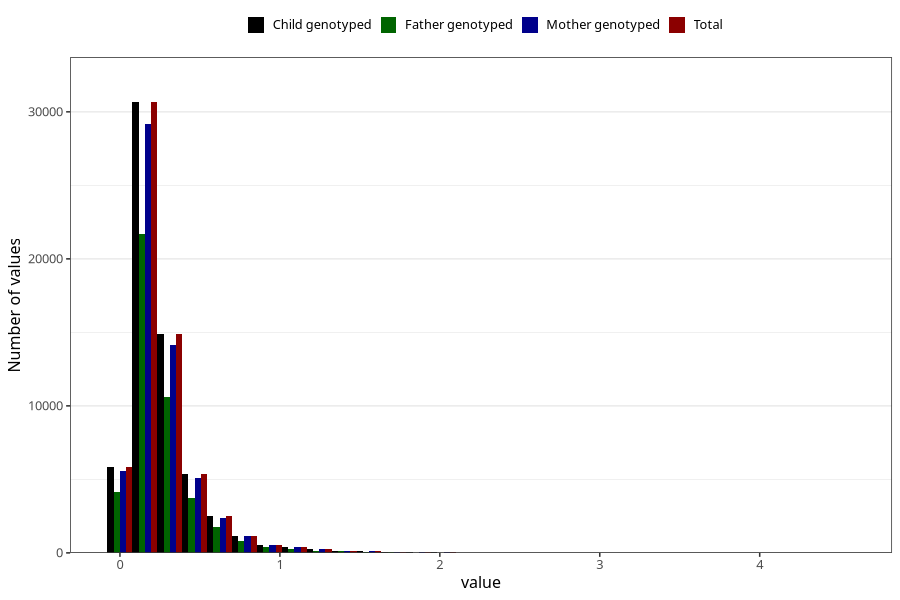

# food_dha_g_day
Variable mapping to `f_dha` in `Skjema2_beregning_CDW_foody_fatty_acid_and_iodine_v12`.
- Number of values:

| Value | Total | Child genotyped | Mother genotyped | Father genotyped |
| ----- | ----- | --------------- | ---------------- | ---------------- |
| Missing | 13178 | 13178 | 12654 | 6217 |
| Non-missing | 62130 | 62130 | 58996 | 43867 |
| 25th percentile | 0.128825 | 0.128825 | 0.1287 | 0.1292 |
| 50th percentile | 0.2018 | 0.2018 | 0.2016 | 0.2018 |
| 75th percentile | 0.3176 | 0.3176 | 0.3172 | 0.31515 |
| Mean | 0.265322980846612 | 0.265322980846612 | 0.264817721540443 | 0.263263637814302 |
| Standard deviation | 0.237056071443768 | 0.237056071443768 | 0.236254396454522 | 0.23251110704188 |
| N | 62130 | 62130 | 58996 | 43867 |

