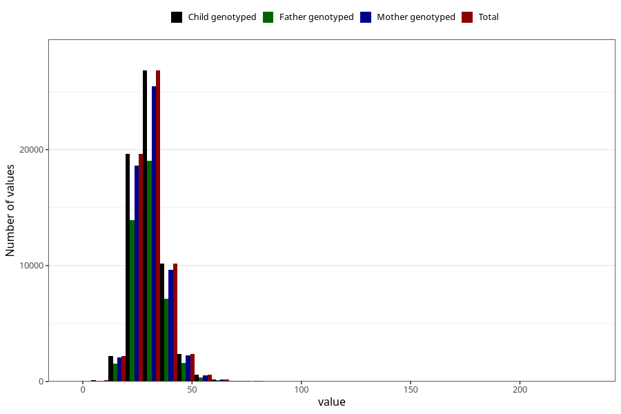

# niacin_eq
Variable mapping to `NIACIN_EQ` in `Skjema2_beregning_CDW_v12`.
- Number of values:

| Value | Total | Child genotyped | Mother genotyped | Father genotyped |
| ----- | ----- | --------------- | ---------------- | ---------------- |
| Missing | 13178 | 13178 | 12654 | 6217 |
| Non-missing | 62130 | 62130 | 58996 | 43867 |
| 25th percentile | 25.78 | 25.78 | 25.78 | 25.77 |
| 50th percentile | 29.85 | 29.85 | 29.84 | 29.78 |
| 75th percentile | 34.53 | 34.53 | 34.51 | 34.43 |
| Mean | 30.6821810719459 | 30.6821810719459 | 30.6690168825005 | 30.5995807782616 |
| Standard deviation | 7.64016660553422 | 7.64016660553422 | 7.61870184866082 | 7.49718296065689 |
| N | 62130 | 62130 | 58996 | 43867 |

