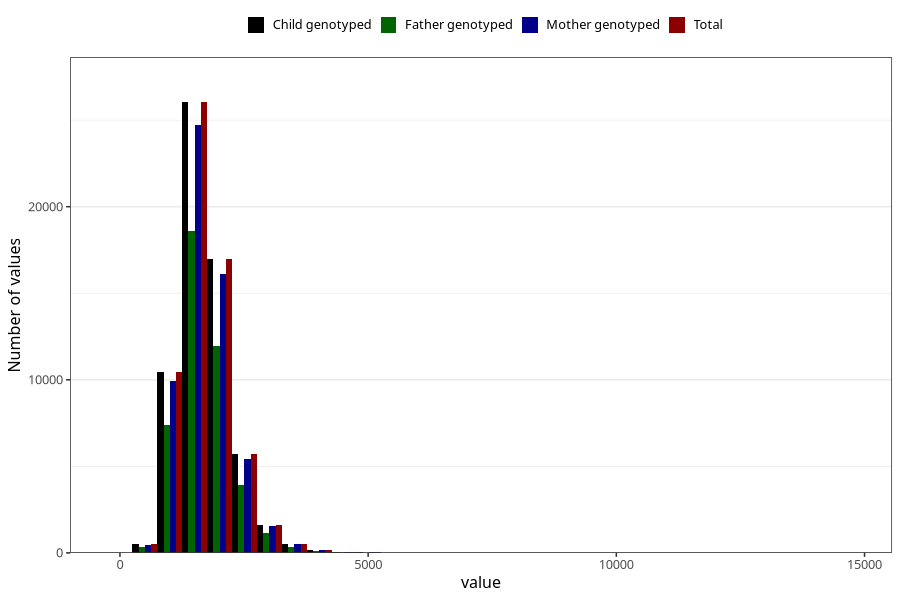

# phosphorus
Variable mapping to `FOSFOR` in `Skjema2_beregning_CDW_v12`.
- Number of values:

| Value | Total | Child genotyped | Mother genotyped | Father genotyped |
| ----- | ----- | --------------- | ---------------- | ---------------- |
| Missing | 13178 | 13178 | 12654 | 6217 |
| Non-missing | 62130 | 62130 | 58996 | 43867 |
| 25th percentile | 1352.485 | 1352.485 | 1352.0825 | 1350.55 |
| 50th percentile | 1641.92 | 1641.92 | 1641.715 | 1637.73 |
| 75th percentile | 1986.6825 | 1986.6825 | 1985.48 | 1978.895 |
| Mean | 1715.32620038629 | 1715.32620038629 | 1714.24528256153 | 1708.30351197939 |
| Standard deviation | 551.357147092177 | 551.357147092177 | 550.032712483028 | 541.539288208314 |
| N | 62130 | 62130 | 58996 | 43867 |

